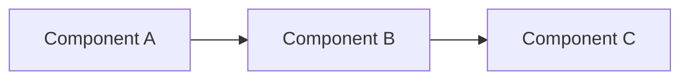

# REPLACE ME — Threat Model Title

## System overview

Brief description of the system or feature being modelled.

## Data flow diagram

## Trust boundaries

Describe where trust boundaries exist in the architecture.

## STRIDE analysis

| Component | Spoofing | Tampering | Repudiation | Info Disclosure | Denial of Service | Elevation of Privilege | Mitigations |
|---|---|---|---|---|---|---|---|
| ... | ... | ... | ... | ... | ... | ... | ... |

## Residual risks

Threats that remain after mitigations, with accepted risk rationale.

## References

- Links to related controls, standards, or systems.
